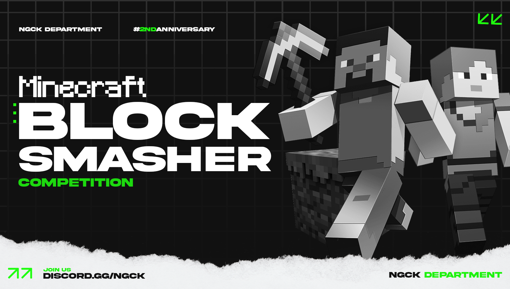

# Minecraft - Block Smasher Competition
A code for Minecraft server plugins for the 2nd-anniversary event of the NGCK Department Community.

### About Event
The event is held to commemorate the 2nd anniversary of the [NTC Department](https://discord.gg/neoteric) community, taking place on January 28, 2023. The gameplay is quite simple, involving destroying as many blocks as possible with a leaderboard system, random events, point deduction during PvP/kill, and more.

### About Plugins
There isn't much that I can explain about the code, but overall, it was created using the Minecraft Module in the Java programming language.